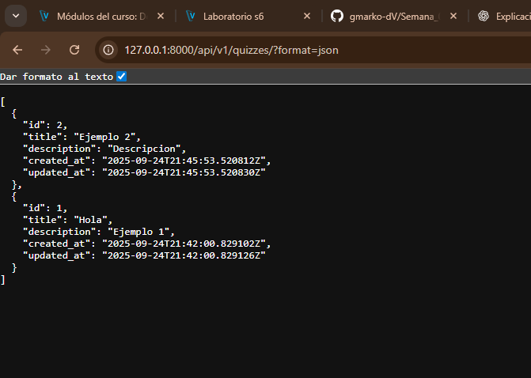

# 📘 Proyecto Django API REST - Semana 06

Este proyecto es una aplicación desarrollada con **Django** y **Django REST Framework**, como parte de la semana 06.  
Aquí se muestran evidencias y pantallazos del desarrollo y funcionamiento.

---

## 🚀 Tecnologías usadas
- [Python 3](https://www.python.org/)
- [Django](https://www.djangoproject.com/)
- [Django REST Framework](https://www.django-rest-framework.org/)
- SQLite 

---

## ⚙️ Instalación y ejecución

1. Clonar el repositorio:
   ```bash
   git clone https://github.com/gmarko-dV/Semana_06.git
   cd Semana_06



